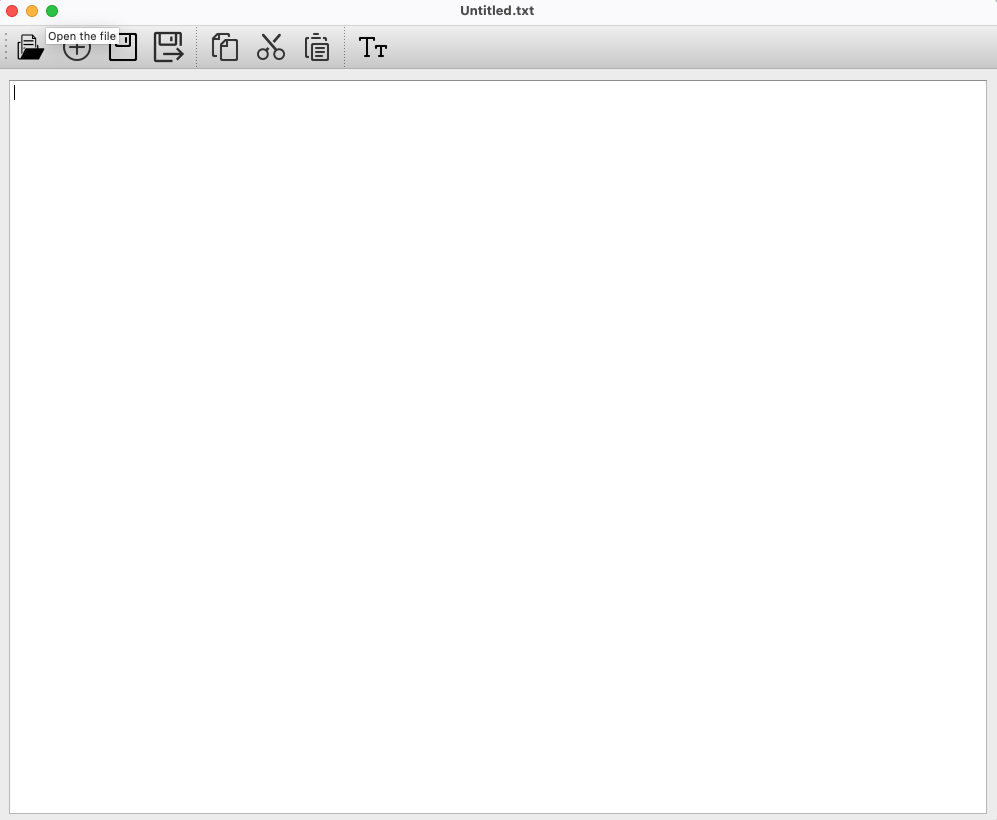

# TextEditor Based on QT document

`Author: Yubo Cai`

## 1. Introduction

This is a simple TextEditor inner the PaperFriend Appliation which allow our client to process the text file with some basic function. The TextEditor is available for both Windows and MacOS.

## 2. Configuring the environment

> QT creator
>
> Visual Studio

---

## 3. Structure of the Source Code

We use **QT Creator** to create the TextEditor application based on the framework of **Qt Widgets Application** with beautifully designed and easy to use GUI and easy programming of functions in Widgets.

The framework of the TextEditor is shown as below:
- Editor.pro
- **Headers**
  - edit.h
  - textedit.h
- **Sources**
  - main.cpp
  - edit.cpp
  - textedit.cpp
- **Forms**
  - textedit.ui
- **Resources**
  - myresources.qrc

The cpp source file which is most base on `textedit.cpp` and `edit.cpp` which accomplish the basic function of the TextEditor. The `textedit.ui` is the UI file which is used to design the GUI of the TextEditor. The `myresources.qrc` is the resource file which is used to store the icon of the TextEditor. The `edit.h` and `textedit.h` are the header file which is used to declare the class of the TextEditor.

## 4. Frontend and Backend Design
### 4.1 Frontend Design
- ① Complete the main software architecture and business logic
- ② Design the GUI of the TextEditor
- ③ Complete the function of loading and saving text

We use the **Qt Desinger** to design the GUI of the TextEditor. The GUI of the TextEditor is shown as below:

We have the tool bar and the menu bar which is used to control the function of the TextEditor.

### 4.2 Backend Design
>Since `Qt` comes with the string storage class `QString` and the stack class `QStack`, we mainly use these classes when implementing the expected functionality and further develop based on them during the development process.

### 4.3 Declaration of the class in program
> We have two main classes of **TextEditor** and **edit**. Details are shown as below:

**TextEditor**: In this class we define the TextEditor interface framework and implement several of its main functions.

**edit**: Defined in `edit.h`, inherited from `QTextEdit`, the main purpose is to overload the function that controls the right-click menu.

---

## 5. Function Design

## Testing Report

1. When saving files, the no button still asks you to save the file.
2. When the file is saved, the warning box still jump out.
